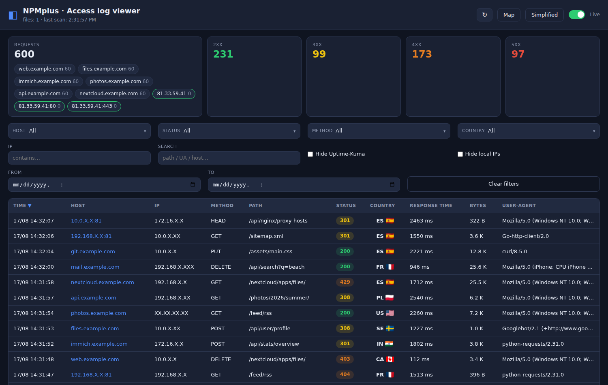
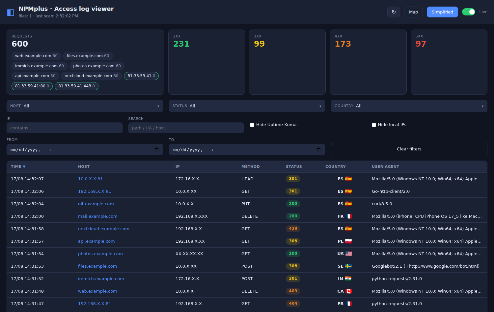
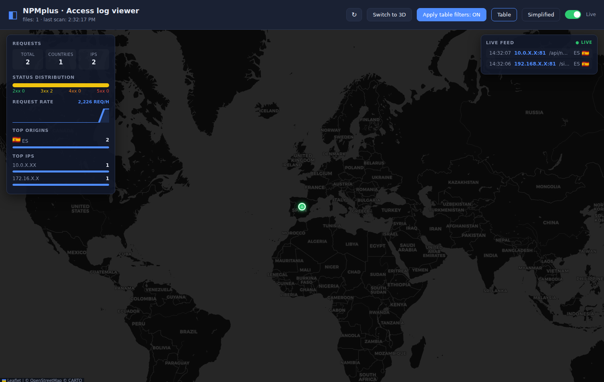
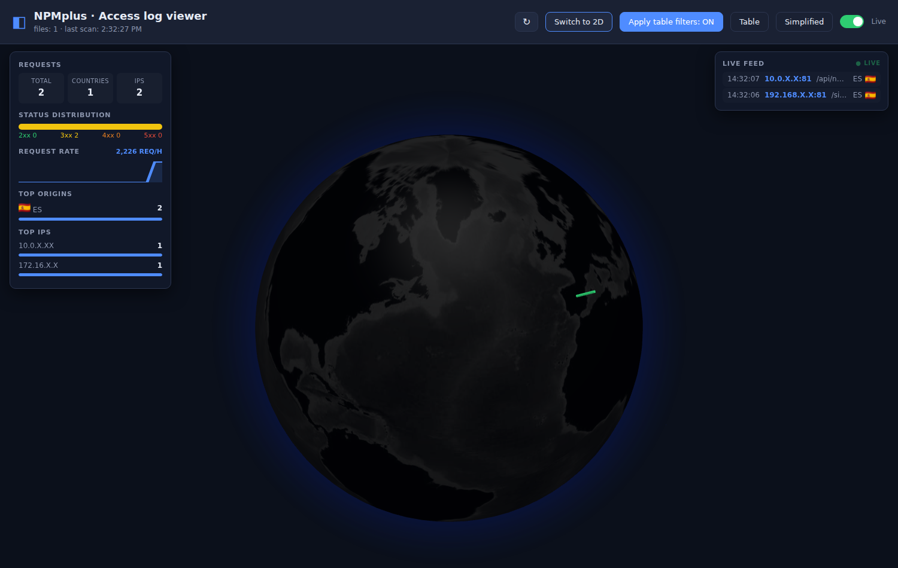

# NPMplus · Access log viewer

[](https://github.com/LoR3daN/npmplus-logviewer/actions/workflows/docker-image.yml)
[](https://ghcr.io/lor3dan/npmplus-logviewer)
[](https://github.com/LoR3daN/npmplus-logviewer)

A web application that **reads and visualizes the Nginx (NPMplus) access logs**
of your reverse proxy: a filterable, sortable and paginated table, a request
summary, and a live animated map of every request pointing to home.

It parses `access.log` and its rotated files (`access.log.1`, `.2`, …), merges
the **two log lines** NPMplus writes per request into a single record, cleans
the noise (Uptime-Kuma healthchecks, local IPs, non-HTTP scanner garbage) and
shows you what is actually happening in real time.

---

## Screenshots

| Table view | Simplified view |
|---|---|
|  |  |

| 2D map | 3D globe |
|---|---|
|  |  |

> The screenshots above use **sample, sanitized data** (masked IPs and
> placeholder hostnames) — they are not real traffic.

---

## Contents

- [Features](#features)
- [Requirements](#requirements)
- [Deploy](#deploy)
  - [Expose it through a proxy host](#expose-it-through-a-proxy-host-optional)
  - [Upgrade to a new version](#upgrade-to-a-new-version)
- [Environment variables](#environment-variables)
- [Supported log format](#supported-log-format)
- [API](#api)
  - [`GET /api/entries`](#get-apientries)
  - [`GET /api/live`](#get-apilive)

---

## Features

### Request table

- Columns: **Time**, **Host/service**, **IP**, **Method**, **Path**, **Status**,
  **Country**, **Response time**, **Bytes** and **User-Agent**.
- Click any column header to sort ascending / descending.
- Pagination with configurable page size (25 / 50 / 100 / 200).

### Filters

- **Multi-select dropdowns** for Host, Status, Method and Country, each with its
  own search box and an "All" option.
- **IP** (contains) and free-text **Search** (matches path, User-Agent, host…).
- **Date range** (`From` / `To`).
- **Hide Uptime-Kuma** — drops the healthcheck noise.
- **Hide local IPs** — hides private / loopback / link-local addresses.
- **Clear filters** resets everything in one click.

All active filters are **persisted on the server** (`/state/prefs.json`) and
restored after a restart or a container upgrade.

### Simplified view

The **Simplified** toggle in the header collapses every *consecutive run* of
requests from the **same IP to the same domain** into a single row (with a
`×N` count badge), no matter the path or status.

- Removes the **Method** filter, and hides the **Path**, **Response time** and
  **Bytes** columns for a cleaner overview.
- Also affects the **map**: one beam per run instead of one per request.

### Request summary cards

- Total requests plus the **2xx / 3xx / 4xx / 5xx** breakdown.
- **Host chips** (clickable, multi-select): click one to filter by it, click
  again to remove it; selected chips are highlighted.
- Chips shown are the hosts declared in `CARDS_HOSTS` (or the top 6 otherwise),
  **plus** the current server public IP as `IP`, `IP:80` and `IP:443` chips
  (green), so you always see your own traffic on both ports.

### Country flags

Every country is shown as its code plus a flag (flagcdn images with an emoji
fallback when the image cannot be loaded).

### Live map

A **Map / Table** toggle opens a full live map centered on the **server public
IP** (resolved via an external IP-location API):

- **2D map** (Leaflet) with a **Switch to 3D** button (globe.gl) — same data,
  two views.
- Each request is animated as a **beam from its country to home**; origin
  pulses at the start.
- **Live feed** panel with the most recent requests.
- **Mini stats** panel: total / distinct countries / distinct IPs, status
  distribution, request rate (**requests per hour**), a rate sparkline, top
  origins and top IPs.
- **Apply table filters ON/OFF** — decide whether the map honors the current
  table filters or shows everything.
- The map history **persists** while you switch back and forth to the table; the
  **feed starts fresh** each time you open the map (only new requests).
- On mobile the app opens directly in map view, showing just the map.

### Robust log parsing

- NPMplus writes two lines per request; they are merged by
  `date + IP + request + status + body`.
- The **method** field only keeps real HTTP methods — TLS/SSH/SMB handshakes and
  other binary scanner payloads are stored as `-` instead of polluting the
  filter and table.

### Live mode

- Auto-refresh every 5 seconds (toggleable) and a **manual rescan** button (↻)
  to force a re-read of the log files immediately.

---

## Requirements

- A machine with **Docker** and **Docker Compose** (for example, the NPMplus
  host itself).
- Access to the NPMplus logs. In the default setup these live on the host at
  `/opt/npmplus/nginx/logs` and contain `access.log*`.

---

## Deploy

The image is built and published automatically to
`ghcr.io/lor3dan/npmplus-logviewer` on every push to `main`.

A ready-to-use [`docker-compose.yml`](docker-compose.yml) is included in the
repository. You can either copy the service into the compose file of your
existing NPMplus project, or deploy it standalone:

```bash
docker compose up -d
```

The service (`docker-compose.yml`):

```yaml
services:
  logviewer:
    container_name: logviewer
    image: ghcr.io/lor3dan/npmplus-logviewer:latest
    restart: unless-stopped
    network_mode: host
    environment:
      - "TZ=Europe/Madrid"
      # Optional: hosts to show as chips on the Requests card (comma separated).
      # Empty = top 6 hosts automatically.
      # - "CARDS_HOSTS=cloud.example.com,jellyfin.example.com,immich.example.com"
      # Optional: force a public IP for the "my IP" chips.
      # Empty = detected automatically (external API) and refreshed periodically.
      # - "MY_IP=<your_public_ip>"
    volumes:
      # NPMplus logs on the host (read only).
      - "/opt/npmplus/nginx/logs:/logs:ro"
      # Writable volume so the filters survive container restarts.
      - "logviewer-state:/state"

volumes:
  logviewer-state:
```

Web: <http://localhost:8899>

### Expose it through a proxy host (optional)

The web app has **no built-in login**. If you expose it through a domain, add an
**Access List** (or Basic Auth) on the NPMplus proxy host:

- Domain: `logs.yourdomain.com`
- Forward hostname/IP: `127.0.0.1`
- Forward port: `8899`

### Upgrade to a new version

```bash
docker compose pull && docker compose up -d
```

---

## Environment variables

| Variable            | Default          | Description                                                        |
|---------------------|------------------|--------------------------------------------------------------------|
| `LOG_DIR`           | `/logs`          | Folder that contains the `access.log*` files                       |
| `REFRESH_SECONDS`   | `5`              | Log rescan interval                                                |
| `TZ`                | `Europe/Madrid`  | Timezone used by the date filters                                  |
| `PREF_FILE`         | `/state/prefs.json` | File where the filters are persisted                            |
| `CARDS_HOSTS`       | *(empty)*        | Hosts to show as chips on the Requests card (comma separated)      |
| `MY_IP`             | *(empty)*        | Override the server public IP used for the "my IP" chips           |
| `PUBLIC_IP_REFRESH` | `600`            | How often (seconds) to re-check the public IP via an external API  |

> **Public IP detection.** When `MY_IP` is empty the app asks a *what-is-my-IP*
> API (ipify, then ifconfig.me, then ipinfo.io) every `PUBLIC_IP_REFRESH`
> seconds and caches the result, so the `IP` / `IP:80` / `IP:443` chips follow
> **dynamic public IPs** automatically. If the API is unreachable it falls back
> to the IP seen in the logs, the request `Host` header, or forwarded client IPs.

---

## Supported log format

Each request generates two lines that the viewer merges into one:

- **With host/service:**
  `[14/Aug/2026:21:54:55 +0200] web.example.com X.X.X.X 0.022 "GET / HTTP/2.0" 200 437 782 - Uptime-Kuma/2.5.0`
- **Standard + country:**
  `X.X.X.X - - [14/Aug/2026:21:54:55 +0200] "GET / HTTP/2.0" 200 437 "-" "Uptime-Kuma/2.5.0" [ES]`

The country (`ES`, `US`, … or `-`) is always taken from the last bracketed
field. Rotated files are handled without duplicates (tracked by inode + size).
On startup the viewer does a full read; afterwards it only reads the new bytes
of each file.

---

## API

| Endpoint | Description |
|----------|-------------|
| `GET /api/stats` | Totals, status/host/method/country facets, configured chips and "my IP" hosts |
| `GET /api/entries` | Filtered, sorted and paginated table rows |
| `GET /api/live` | Recent requests with country coordinates for the map |
| `GET /api/home` | Public IP location (lat / lon / city / country) for the map home |
| `GET /api/prefs` | Current saved filters |
| `POST /api/prefs` | Save filters |
| `POST /api/reload` | Rescan the log files now |

### `GET /api/entries`

Parameters:

`host`, `status`, `method`, `country` — comma-separated multi-select values
(`2xx`/`3xx`/`4xx`/`5xx` buckets are supported for `status`).

`ip`, `q` — contains filters for the IP and a free-text search.

`exclude_ua` — comma-separated User-Agent substrings to hide (e.g. `Uptime-Kuma`).

`exclude_local` — `true` to hide private/loopback/link-local IPs.

`from`, `to` — ISO date range (local timezone).

`collapse` — `true` for the simplified view (collapse consecutive same IP+domain runs).

`sort` (`ts`|`status`|`time`|`body`), `order` (`asc`|`desc`), `page`, `size`.

### `GET /api/live`

Same filters as `/api/entries`, plus `after` (epoch, incremental polling) and
`limit`. Returns items with `lat`/`lon`/`cc` resolved from the country centroid,
used by the map beams.
